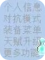

<!-- quickstart.md -->

## 武装自己

当你第一次进入服务器,会给予你新手物资

](./image/Inventory.png)

其中有铁套和四瓶水,这个时候 **不要急着把铁套装备上**  
正确的做法 **抬头丢出装备** 装备成功后会增加你的基础属性

## 你的快捷栏

刚刚进入游戏,你的快捷栏应该长这样

?>快捷栏第七格,那是一个经验瓶,也是游戏里最常用的菜单  
个人信息,开关PVP,拆卸装备,天赋升级等操作均在里面进行

?>快捷栏第八格,是一个屏障,当你装备上远程武器后变为弓箭  

?>快捷栏第九格,是一个屏障,当你装备上近战武器后变为雪球  

## 攻击敌人

在你装备上武器后第九格快捷栏会出现雪球  
扔出雪球后会出现一道剑气劈向敌人  
那便是你攻击敌人的手段

## 经验瓶菜单  

当你打开经验瓶后你会看见五个选项  
  
1. 个人信息
   - 个人信息可以查看你的  **等级** **余额** **在线时长** **属性** 等基础信息
2. 对抗模式
   - 对抗模式可以理解为 **开关PVP模式** 当你关闭时玩家不能对你造成伤害,你也无法对其他玩家造成伤害
3. 装备菜单
   - 装备菜单内有三个分类
      - 武器 武器内有
         - 近战武器
         - 远程武器
      - 防具 防具里有
         - 头盔  
         - 胸甲  
         - 护腿  
         - 靴子  
         - 护盾  
      - 护符 护符内有
         - 护符
         - 没了QAQ
    - 装备菜单可以用来拆卸以及装备上的装备
    -装备可以用过抽奖机抽奖,进阶合成台合成,怪物掉落,或是商城购买
4. 天赋升级
   - 